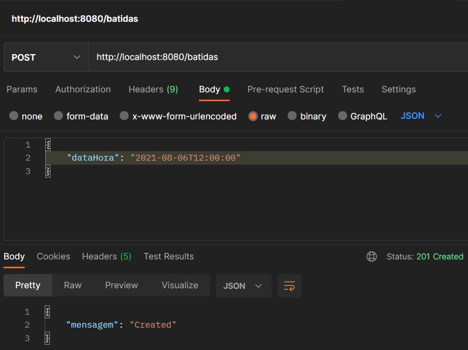
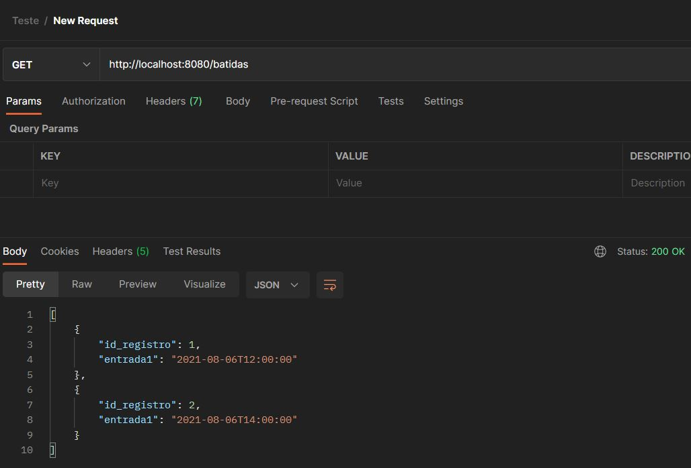

## Sistema Batida de ponto
Api feita com spring-boot + MYSQL + docker-compose e REST para registrar batidas de ponto.

O sistema recebe um horário e faz seguintes validações:
- Verifica se Data e hora estão em formato válido
- Verifica campo obrigatório
- Verifica se o dia da batida de ponto é final de semana ( Sábado ou Domingo)
- Verifica se há até 4 batidas em um mesmo dia (caso já tenha 4 não deixa cadastrar)
- Verifica batidas duplicadas (batida com mesma data e horário)

Para rodar o sistema execute os comandos abaixo na pasta raiz do projeto.


## Compilar o projeto
```sh
./mvnw.cmd clean install
```

## Subindo a aplicação com Docker-compose
```sh
docker-compose up --build --force-recreate
```
### A aplicação possui:
    - GET  
    - POST

### Cadastrar uma batida:


### Verifique as batidas

